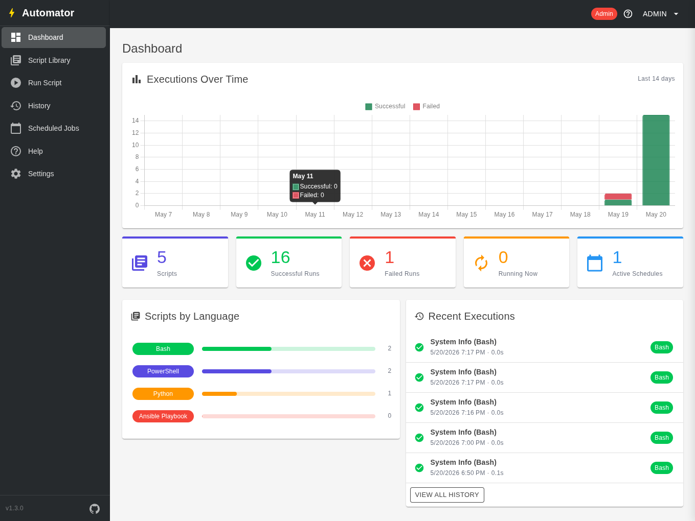
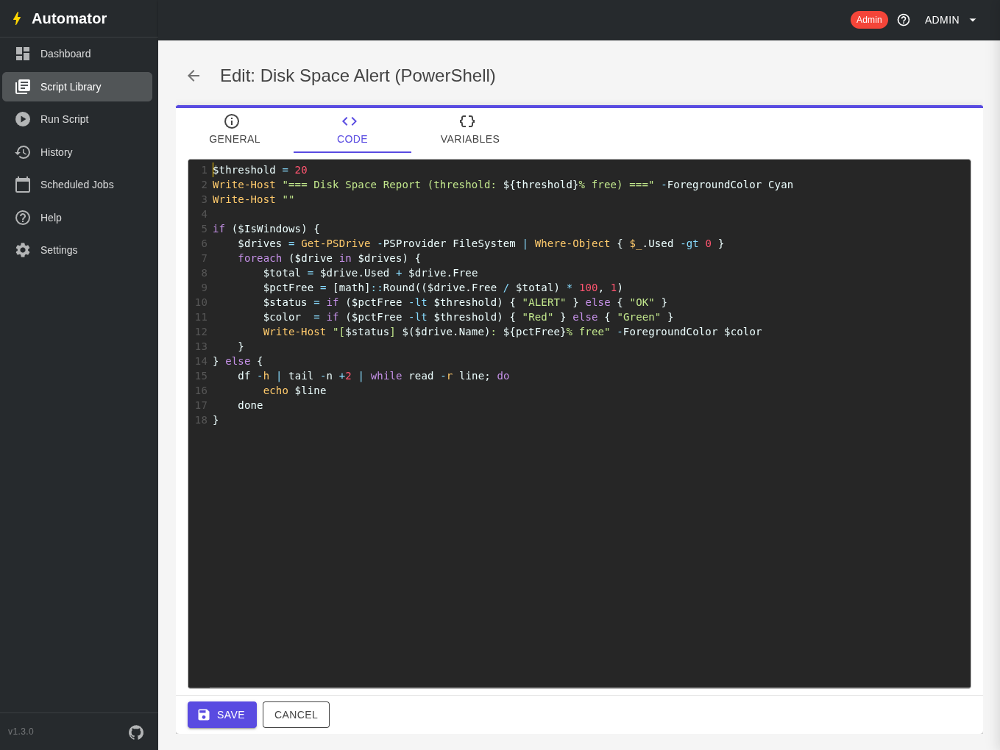
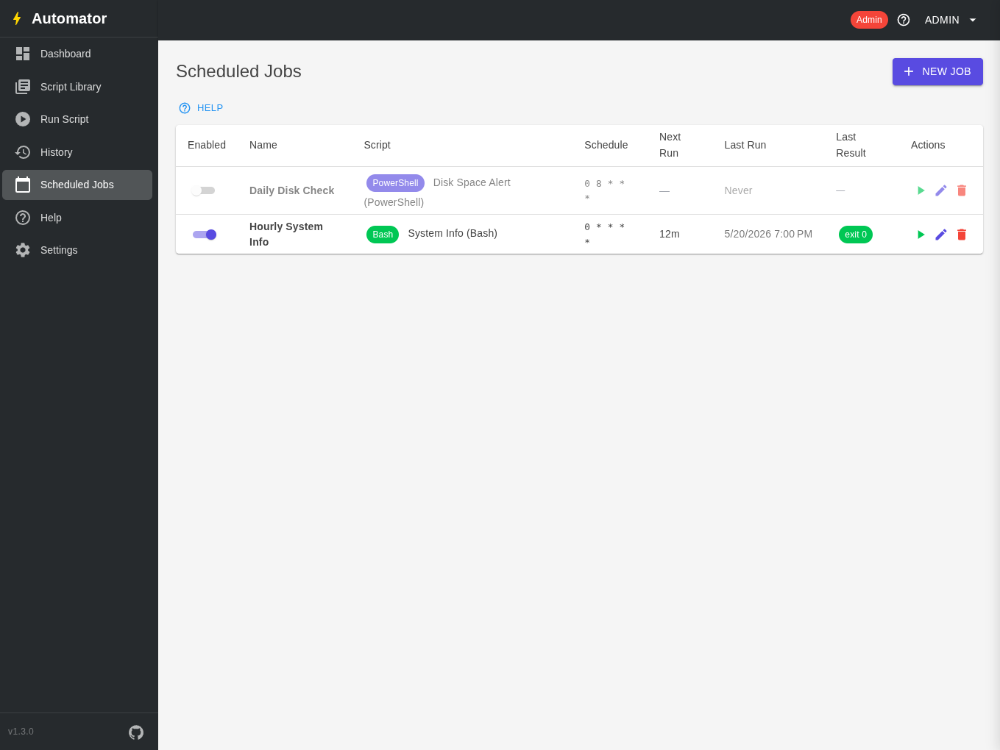
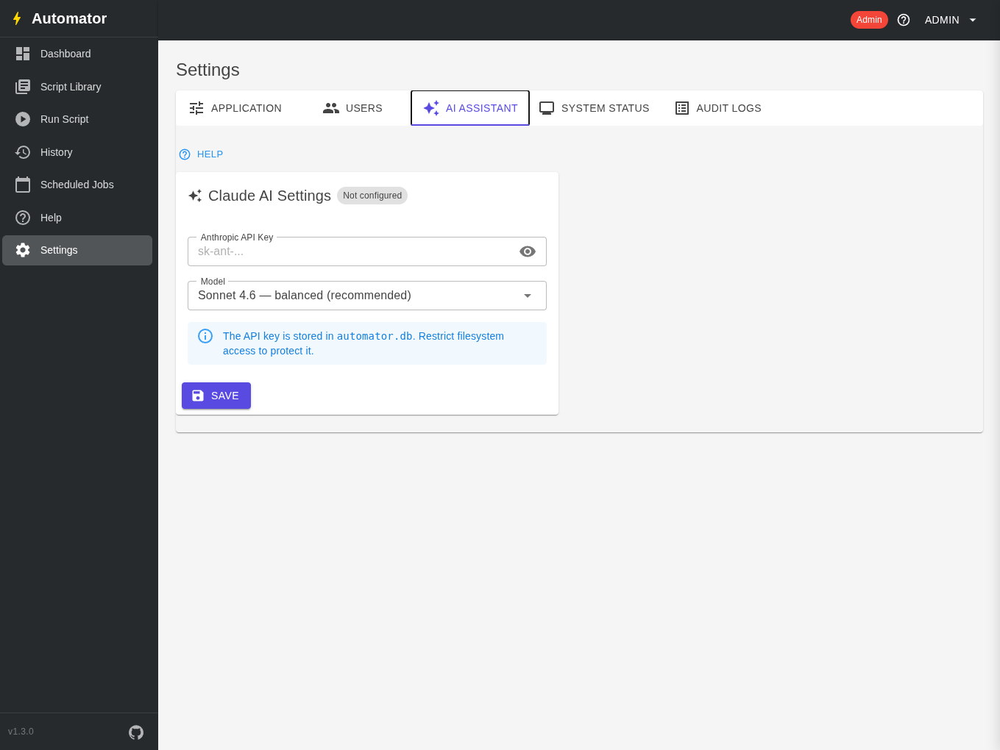

# Automator

A cross-platform web application for managing and automating IaaS scripts. Built with ASP.NET Core 9 Blazor Server, it runs on Windows Server and all major Linux distributions.

## Features

- **Script Library** — store, organize, and search Bash, PowerShell, Python, Ansible, and Terraform scripts
- **Tabbed script editor** — General, Code, and Variables tabs; viewport-filling CodeMirror editor with unsaved-changes guard
- **Syntax highlighting** — per-language highlighting with read-only source viewers throughout the app
- **Script variables** — define typed variables (Text, Number, Array) per script; injected as environment variables at runtime; required-field validation blocks execution until filled
- **AI assistant** — generate, improve, and explain scripts using Claude (Anthropic API); optional, falls back gracefully when unconfigured
- **Live Script Runner** — execute scripts and stream output in real time with cancel support
- **Job Scheduler** — cron-based scheduling with a background service, live next-run preview, and per-job enable/disable
- **Execution History** — log of every run with exit codes and full output
- **Role-based access control** — Admin, Developer, Operator, and Viewer roles
- **User management** — create, edit, and disable users from the Settings page
- **Audit log** — tamper-evident record of all create/edit/delete/run actions
- **System status** — runtime dependency checks and database statistics
- **Comprehensive help system** — dedicated `/help` page, context-sensitive slide-out drawer, and inline help throughout
- **Persistent storage** — SQLite (default, zero-config) or MySQL/MariaDB

## Supported Languages

| Language | Windows | Linux |
|---|---|---|
| Bash | via WSL | `/bin/bash` |
| PowerShell | `powershell.exe` | `pwsh` (PowerShell Core) |
| Python | `python.exe` | `python3` |
| Ansible Playbook | — | `ansible-playbook` |
| Terraform | `terraform.exe` | `terraform` |

## Roles

| Role | Scripts | Run Scripts | Schedule Jobs | Settings / Users |
|---|---|---|---|---|
| Admin | create / edit / delete | yes | create / edit / delete | yes |
| Developer | create / edit / delete | yes | create / edit / delete | — |
| Operator | view | yes | view | — |
| Viewer | view | — | view | — |

## AI Assistant (optional)

The script editor includes a Claude-powered AI assistant that can generate scripts from a description, improve existing scripts, and explain what a script does in plain language. It requires an [Anthropic API key](https://console.anthropic.com/settings/keys) and is completely optional.

To enable it: **Settings → AI Assistant** → paste your API key → choose a model → Save.

| Model | Best for |
|---|---|
| Haiku 4.5 | Fast iteration, low cost |
| Sonnet 4.6 | Balanced quality and speed (default) |
| Opus 4.7 | Complex scripts requiring deep reasoning |

## Tech Stack

- [ASP.NET Core 9](https://learn.microsoft.com/aspnet/core) — web framework
- [Blazor Server](https://learn.microsoft.com/aspnet/core/blazor) — interactive UI with real-time output streaming
- [ASP.NET Core Identity](https://learn.microsoft.com/aspnet/core/security/authentication/identity) — authentication and role-based authorization
- [Entity Framework Core 9](https://learn.microsoft.com/ef/core) — ORM; SQLite (default) or MySQL/MariaDB
- [MudBlazor 9](https://mudblazor.com) — component library
- [CodeMirror 5](https://codemirror.net/5/) — syntax-highlighted editor (vendored, no CDN)
- [Cronos](https://github.com/HangfireIO/Cronos) — cron expression parsing
- [Anthropic API](https://docs.anthropic.com/en/api/getting-started) — Claude AI assistant (optional)

## Project Structure

```
Automator/
├── packaging/
│   ├── build.sh                    # builds linux-x64 and win-x64 release archives
│   ├── linux-common/               # shared systemd unit and nginx config
│   ├── ubuntu/                     # install.sh and uninstall.sh for Ubuntu
│   ├── rhel/                       # install.sh and uninstall.sh for RHEL / Rocky / Alma
│   └── windows/                    # install.ps1 and uninstall.ps1 for Windows Server
├── src/
│   └── Automator.Web/
│       ├── Components/
│       │   ├── Layout/             # Shell layout, nav sidebar, header
│       │   ├── Pages/              # Dashboard, Script Library, ScriptEditor, Runner, History, Jobs, Settings, Help
│       │   └── Shared/             # CodeEditor, HelpDrawer, help sections, PageHelp, HelpIcon, panels
│       ├── Data/
│       │   ├── AutomatorDbContext.cs   # EF Core context
│       │   └── DataSeeder.cs           # First-run role, user, and settings seeding
│       ├── Models/                 # ScriptDefinition, ScriptVariable, ScheduledJob, ScriptExecutionResult, AuditLog, AppSetting
│       ├── Services/
│       │   ├── ScriptRunnerService         # Executes scripts as subprocesses, persists results
│       │   ├── JobSchedulerService         # Cron job store
│       │   ├── SchedulerBackgroundService  # 15s tick, fires due jobs
│       │   ├── AuditLogService             # Writes audit entries to DB
│       │   ├── ClaudeService               # Anthropic API client with SSE streaming
│       │   ├── DependencyCheckService      # Probes runtimes for System Status page
│       │   └── HelpDrawerState             # Scoped state service for the help drawer
│       └── wwwroot/
│           └── lib/codemirror/             # CodeMirror 5 — vendored, no CDN dependency
└── Automator.sln
```

## Screenshots

| Dashboard | Script Editor |
|---|---|
|  |  |

| Scheduled Jobs | Settings — AI Assistant |
|---|---|
|  |  |

## Documentation

- [docs/INSTALL.md](docs/INSTALL.md) — pre-built packages, build from source, and configuration reference
- [docs/USAGE.md](docs/USAGE.md) — script editor, variables, runner, scheduler, and cron reference

## License

[MIT](LICENSE)
